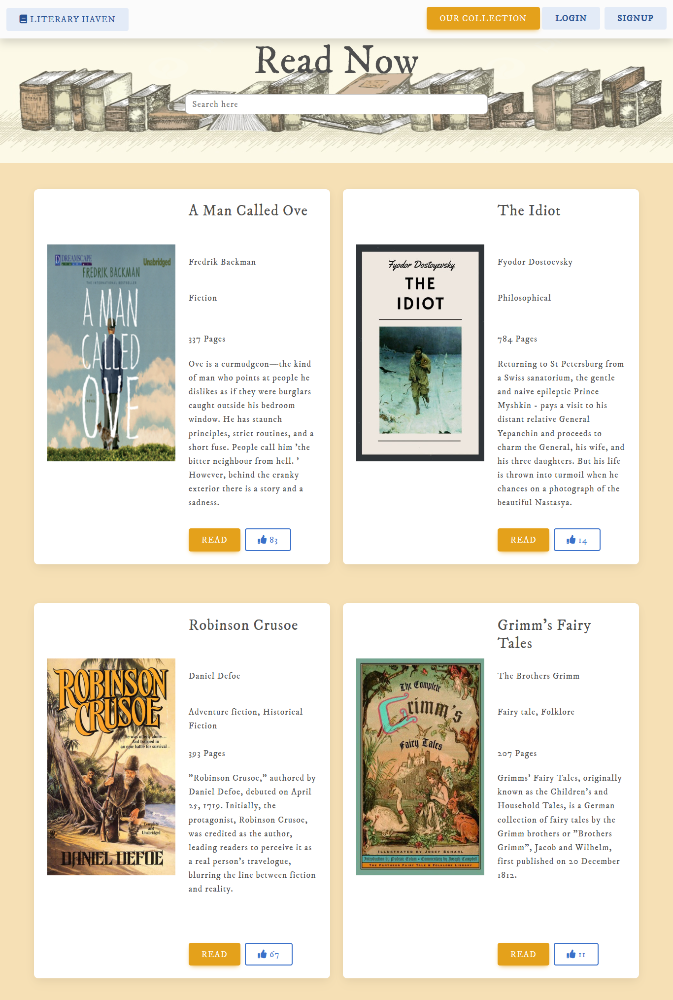

# Literary Haven  : A Free eBook Reading Platform

### Introducing Literary Haven- a project offering free seamless eBook reading across devices. Dive into the world of literature without limitations, as Literary Haven guarantees optimal readability and a captivating experience on every device.

## Table of Contents
* [Commands](#commands)
* [Usage](#usage)

## Commands
### To run Frontend - npm start
### To run Backend - npm run dev

# Usage

## Home
#### Once the app starts, you will find yourself on the Home page, which includes various sections such as the best collection, about us, and copyright.

#Our Collection
### Upon clicking the 'Get Started' button or the 'Read' button (located in the 'Best Collection' section), you will be directed to the 'Our Collection' page.
### You can read the book by clicking the 'Read' button.
### On clicking the 'Like' button, a like is added that persists even after refreshing the page.

